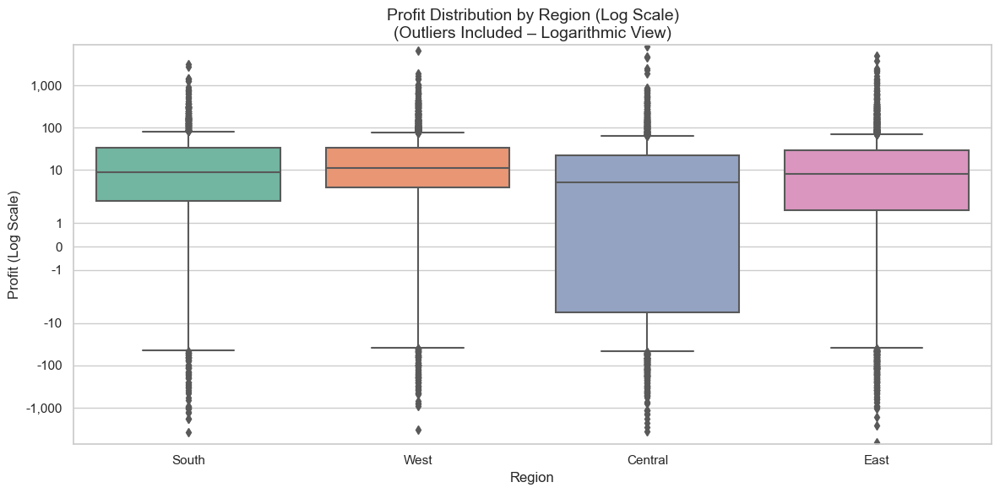

\# Retail Sales Performance Dashboard

This project explores and visualises sales data from a fictional company, Global Superstore. The goal is to uncover insights about sales trends, profit performance, product categories, and regional breakdowns using Python and data visualisation tools.

---

\## Project Overview

\*\*Client Brief (Fictional):\*\*  

Global Superstore operates across several regions and sells a wide range of office supplies, furniture, and technology products. Management needs a clear, data-driven dashboard to help:

\- Identify best-selling products

\- Highlight underperforming regions

\- Understand profit drivers and loss areas

\- Spot seasonal trends in customer purchases

---

\## Objectives

\- Clean and prepare raw retail data

\- Perform exploratory data analysis (EDA)

\- Visualise key sales and profit metrics

\- Provide actionable business insights

\- Build a dashboard-ready dataset

---

\## Key Business Questions

\- Which product categories and sub-categories generate the most profit?

\- How do sales vary across states and cities?

\- Which regions are underperforming or over-discounted?

\- Are there any seasonal trends in order volume?

\- Is there a relationship between discount and profit?

---

\## Project Structure

retail-sales-dashboard/

├── data/

│ └── Superstore.csv # Raw dataset

├── notebooks/

│ ├── 01\_data\_cleaning.ipynb # Data cleaning and prep

│ └── 02\_dashboard\_analysis.ipynb # EDA and charts

├── outputs/

│ └── charts/ # Saved images and plots

├── README.md # Project documentation

└── requirements.txt # Python libraries used

---

\## Tools \& Libraries

\- Python 3.11.5

\- Jupyter Notebook

\- pandas

\- matplotlib

\- seaborn

\- statsmodels (for time series decomposition)

---

## 📈 Insights , Findings & Recommendations

1. **Overall Performance**  
   - Total Sales: \$2,297,200.86  
   - Total Profit: \$286,397.02  
      - Total Quantity Sold: 37,873 items

2. **Discount vs Profit**  
   - Negative correlation: deeper discounts erode profit margins.

3. **Category & Sub-Category Profitability**  
   - **Technology** leads in profit (notably Copiers & Phones).  
   - **Furniture** lags, driven by Tables, Bookcases, Furnishings losses.

4. **Regional Profit Variability**  
   - East & Central regions show the greatest profit volatility.  
   - West region demonstrates consistent margins.

5. **Seasonal Trends**  
   - Peaks in Nov–Dec; dips early to mid-year (January - February) (June–July).  
   - Profit tracks sales but with lag in certain months.

6.  **Business Recommendations**
      - Reduce discounting on underperforming sub-categories (e.g. Tables, Bookcases) where deep discounts result in net losses.
      - Focus marketing and inventory planning on Copiers and Phones which drive strong profitability.
      - Investigate shipping/logistics in the South region to understand root causes of repeated losses.
      - Ramp up marketing campaigns and stock in Q4 (especially November–December) to maximise seasonal demand.
      - Monitor early to mid-year slowdowns and explore promotions or product bundling to offset sales dips.

---

## 📊 Visualisations

  
  
  
  
  

  
  

---

\## 📥 Data Source

\- 📁 `Superstore.csv` — A fictional retail dataset available on \[Kaggle](https://www.kaggle.com/datasets/vivek468/superstore-dataset-final)

---

\## ✍️ Author

\*\*Ka Wai Gary Lai\*\*  

Data Analyst | Creative Problem Solver | Esports \& TCG Enthusiast

---

\## 📌 Status

🟢 Complete — EDA & insights finalized   

📅 Last Updated: July 2025

